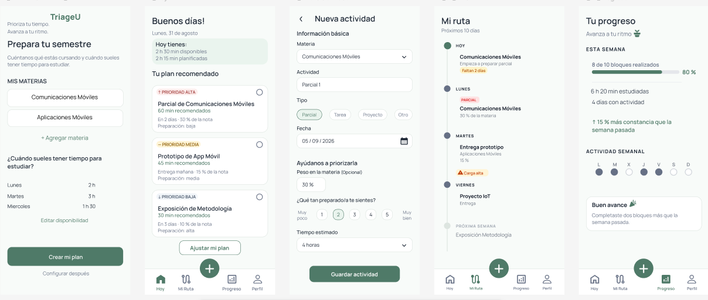

# TriageU

App Android para priorizar el tiempo de estudio. Ayuda al estudiante a organizar materias, ver qué hacer hoy, anticipar compromisos y seguir su progreso.

**Prioriza tu tiempo. Avanza a tu ritmo.**



Proyecto académico — Universidad del Cauca.

---

## Características

- **Configuración inicial** — Materias y disponibilidad sin registro obligatorio
- **Hoy** — Actividades del día con prioridad (alta / media / baja) y recomendaciones
- **Mi Ruta** — Línea de tiempo de próximos compromisos y alertas de carga
- **Progreso** — Bloques completados, días activos y tendencia semanal
- **Nueva actividad** — Formulario simple desde el botón +
- **Perfil** — Resumen de materias
- **Firebase** — Auth anónimo + Firestore (persistencia en la nube)
- **Campos extendidos** — dueDate, type, notes, reminderEnabled, estimatedDifficulty, actualTimeSpent, tags

---

## Stack técnico

| Tecnología              | Uso                                      |
|-------------------------|------------------------------------------|
| Kotlin                  | Lenguaje                                 |
| Jetpack Compose         | UI                                       |
| Material Design 3       | Tema y componentes                       |
| Navigation Compose      | Navegación entre pantallas               |
| ViewModel + StateFlow   | Estado de la app                         |
| Firebase Authentication | Usuario anónimo (sin registro obligatorio)|
| Cloud Firestore         | Base de datos remota                     |

**Requisitos:** minSdk 28 · targetSdk 37 · Kotlin 2.2 · AGP 9.4

---

## Arquitectura de la aplicación

```
┌─────────────────────────────────────────┐
│           UI (Jetpack Compose)          │
│  Setup · Hoy · Mi Ruta · Progreso       │
│  Nueva actividad · Perfil               │
└──────────────────┬──────────────────────┘
                   │ StateFlow / eventos
                   ▼
┌─────────────────────────────────────────┐
│              AppViewModel               │
│  · AppUiState                           │
│  · Lógica de prioridad                  │
│  · Coordinación de pantallas            │
└──────────────────┬──────────────────────┘
                   │
                   ▼
┌─────────────────────────────────────────┐
│           TriageRepository              │
│  · ensureUser / Auth anónimo            │
│  · CRUD actividades, materias, etc.     │
│  · Flujos en tiempo real (snapshots)    │
└──────────────────┬──────────────────────┘
                   │
                   ▼
┌─────────────────────────────────────────┐
│     Firebase (Auth + Cloud Firestore)   │
└─────────────────────────────────────────┘
```

### Principios

1. Las **pantallas no conocen Firebase**; solo observan `AppUiState`.
2. El **ViewModel** expone estado y acciones; decide cuándo llamar al repositorio.
3. El **Repository** es el único punto de acceso a Auth y Firestore.
4. Hay **modelos de UI** (`ActivityItem`, `Subject`, …) y **modelos de Firestore** (`FirestoreActivity`, …), unidos por **mappers**.
5. Si no hay red, la app puede seguir con datos locales de ejemplo (modo degradado).

### Estructura de paquetes

```
app/src/main/java/edu/unicauca/aplimovil/composelble4/
├── MainActivity.kt
├── TriageUApplication.kt          ← inicializa Firebase
├── data/
│   ├── model/FirestoreModels.kt   ← modelos remotos
│   ├── mapper/Mappers.kt          ← UI ↔ Firestore
│   └── repository/TriageRepository.kt
├── viewmodel/
│   └── AppViewModel.kt
└── ui/
    ├── App.kt
    ├── navigation/
    ├── screens/
    │   ├── SetupScreen.kt
    │   ├── HoyScreen.kt
    │   ├── MiRutaScreen.kt
    │   ├── ProgresoScreen.kt
    │   ├── NuevaActividadScreen.kt
    │   └── PerfilScreen.kt
    └── theme/
```

---

## Base de datos remota — Cloud Firestore

### Autenticación

- Proveedor: **Anonymous**
- Al iniciar, `ensureUser()` crea o reutiliza un UID.
- No se pide email ni contraseña (alineado con “mostrar valor antes del registro”).

### Jerarquía de colecciones

```
users/{uid}
  ├── (documento de perfil)
  ├── subjects/{subjectId}
  ├── activities/{activityId}
  ├── availability/{dayId}
  └── progress/summary
```

### Documento de usuario — `users/{uid}`

| Campo               | Tipo      | Descripción                    |
|---------------------|-----------|--------------------------------|
| displayName         | string    | Nombre mostrado                |
| email               | string?   | Opcional                       |
| setupComplete       | boolean   | Si terminó la configuración    |
| availableTimeToday  | string    | Ej. "2 h 30 min"               |
| createdAt           | timestamp | Servidor                       |

### Materias — `users/{uid}/subjects/{id}`

| Campo     | Tipo      |
|-----------|-----------|
| name      | string    |
| color     | string    |
| createdAt | timestamp |

### Actividades — `users/{uid}/activities/{id}`

| Campo                | Tipo       | Descripción                          |
|----------------------|------------|--------------------------------------|
| title                | string     | Título                               |
| subjectId            | string     | Referencia lógica a subject          |
| subjectName          | string     | Desnormalizado para lectura rápida   |
| type                 | string     | PARCIAL, ENTREGA, EXPOSICION, …      |
| durationMin          | number     | Duración estimada (minutos)          |
| priority             | string     | HIGH · MEDIUM · LOW                  |
| weightPercent        | number?    | % de la nota                         |
| preparation          | number     | 1–5                                  |
| dueDate              | timestamp? | Fecha real de entrega                |
| dueText              | string     | Texto legible ("En 2 días")          |
| completed            | boolean    |                                      |
| recommended          | boolean    |                                      |
| notes                | string     | Notas del estudiante                 |
| reminderEnabled      | boolean    | Para notificaciones futuras          |
| estimatedDifficulty  | number     | 1–5                                  |
| actualTimeSpent      | number?    | Minutos reales dedicados             |
| tags                 | array      | Ej. ["urgente", "grupo"]             |
| createdAt            | timestamp  |                                      |
| completedAt          | timestamp? | Al marcar completada                 |

### Disponibilidad — `users/{uid}/availability/{dayId}`

| Campo   | Tipo   |
|---------|--------|
| day     | string |
| hours   | string |
| minutes | number |

### Progreso — `users/{uid}/progress/summary`

| Campo              | Tipo    |
|--------------------|---------|
| blocksDone         | number  |
| blocksTotal        | number  |
| studiedTimeMin     | number  |
| activeDays         | number  |
| weekDays           | map     |
| consistencyChange  | string  |
| progressMessage    | string  |
| lastUpdated        | timestamp |

### Qué se escribe desde la app (hoy)

| Acción en la app              | Escritura en Firestore                          |
|-------------------------------|-------------------------------------------------|
| Abrir app                     | Usuario anónimo (+ perfil si no existía)        |
| Completar setup               | Perfil + subjects + availability                |
| Saltar setup                  | Solo perfil                                     |
| Guardar actividad nueva (+)   | Documento en `activities`                       |
| Marcar actividad completada   | `completed` + `completedAt`                     |

### Reglas de seguridad (resumen)

Solo el usuario autenticado puede leer/escribir su propio árbol `users/{uid}/**`.

Ver archivo `firestore.rules` en la raíz del proyecto.

---

## Base de datos local — Propuesta con Room

Objetivo: **offline-first**. Room como fuente de verdad en el dispositivo; Firestore como sync y multi-dispositivo.

### Modelo relacional propuesto

```
user_profile (opcional)
    │
    ├── subjects  (1:N)
    │       │
    │       └── activities  (FK subjectId)
    │
    ├── availability
    └── progress  (1 fila)
```

### Tablas

**subjects**

| Columna   | Tipo   | Notas        |
|-----------|--------|--------------|
| id        | Long   | PK auto      |
| name      | String |              |
| color     | String |              |
| createdAt | Long   | epoch millis |

**activities**

| Columna              | Tipo    | Notas                          |
|----------------------|---------|--------------------------------|
| id                   | Long    | PK auto                        |
| subjectId            | Long?   | FK → subjects (SET NULL)       |
| title                | String  |                                |
| subjectName          | String  | desnormalizado                 |
| type                 | String  |                                |
| durationMin          | Int     |                                |
| priority             | String  | HIGH / MEDIUM / LOW            |
| weightPercent        | Int?    |                                |
| preparation          | Int     |                                |
| dueDate              | Long?   | epoch millis                   |
| dueText              | String  |                                |
| completed            | Boolean |                                |
| recommended          | Boolean |                                |
| notes                | String  |                                |
| reminderEnabled      | Boolean |                                |
| estimatedDifficulty  | Int     |                                |
| actualTimeSpent      | Int?    |                                |
| tagsJson             | String  | JSON de lista                  |
| createdAt            | Long    |                                |
| completedAt          | Long?   |                                |

Índices sugeridos: `subjectId`, `dueDate`, `completed`.

**availability**

| Columna | Tipo   | Notas        |
|---------|--------|--------------|
| id      | Long   | PK           |
| day     | String | unique       |
| hours   | String |              |
| minutes | Int    |              |

**progress**

| Columna            | Tipo   | Notas     |
|--------------------|--------|-----------|
| id                 | Int    | PK (= 1)  |
| blocksDone         | Int    |           |
| blocksTotal        | Int    |           |
| studiedTimeMin     | Int    |           |
| activeDays         | Int    |           |
| weekDaysJson       | String |           |
| consistencyChange  | String |           |
| progressMessage    | String |           |
| lastUpdated        | Long   |           |

**user_profile** (opcional, útil para sync)

| Columna             | Tipo    |
|---------------------|---------|
| uid                 | String PK |
| displayName         | String  |
| setupComplete       | Boolean |
| availableTimeToday  | String  |
| createdAt           | Long    |

### Arquitectura offline-first (propuesta)

```
UI → AppViewModel → TriageRepository
                         │
            ┌────────────┴────────────┐
            ▼                         ▼
     Room (local)              Cloud Firestore
   fuente de verdad              sync / backup
```

1. Toda lectura/escritura prioritaria va a Room.
2. Con red, el repositorio sincroniza hacia/desde Firestore.
3. La UI no cambia: sigue consumiendo el mismo `AppViewModel`.

---

## Comparación Firestore vs Room

| Aspecto            | Firestore (actual)     | Room (propuesta)           |
|--------------------|------------------------|----------------------------|
| Modelo             | Documentos/colecciones | Tablas + FK                |
| Offline            | Caché de SDK           | Nativo, control total      |
| Multi-dispositivo  | Sí                     | No (salvo + sync)          |
| Consultas          | Por colección/índices  | SQL / @Query               |
| Relaciones         | Desnormalización       | Foreign keys + @Relation   |

---

## Flujo de datos actual (secuencia)

1. `init` → `ensureUser()` → `signInAnonymously()`
2. `observeActivities()` → snapshotListener en `users/{uid}/activities`
3. `saveNewActivity()` → `addActivity()` → documento en Firestore
4. `toggleActivityCompleted()` → update `completed` + `completedAt`
5. `completeSetup()` → perfil + subjects + availability

---

## Cómo ejecutar

1. Clona o abre el proyecto en **Android Studio**
2. Verifica que exista `app/google-services.json`
3. En Firebase Console:
   - Authentication → **Anonymous** habilitado
   - Firestore creado con las reglas de `firestore.rules`
4. **Sync Project with Gradle Files**
5. Ejecuta en emulador o dispositivo (minSdk 28)

### Cómo verificar Firebase

1. Abre la app → en Authentication debe aparecer un usuario Anonymous.
2. Crea una actividad con **+** → debe verse en Firestore bajo `users/{uid}/activities`.
3. Márcala completada → el documento debe tener `completed: true`.

---

## Sistema visual

| Uso        | Color          | HEX     |
|------------|----------------|---------|
| Principal  | Verde salvia   | #4F7A68 |
| Verde suave| Fondo/selección| #EAF4EE |
| Fondo      | Blanco verdoso | #F8FBF9 |
| Texto      | Gris oscuro    | #1F2937 |
| Secundario | Gris           | #667085 |

---

## Principios de diseño

1. Diseñar con intención  
2. Navegación fácil y natural  
3. Ser claros y directos  
4. Mostrar valor antes del registro  
5. Formularios simples y flexibles  
6. Dar control y flexibilidad  
7. Dar retroalimentación  
8. Diseñar para todos  
9. Mantener consistencia  
10. Privacidad y permisos  

---

## Licencia

Proyecto académico — Universidad del Cauca.
